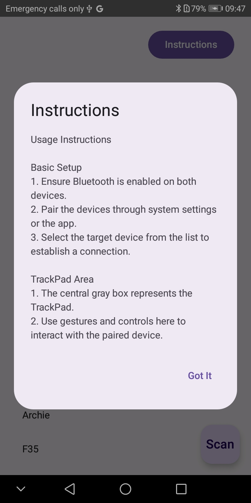
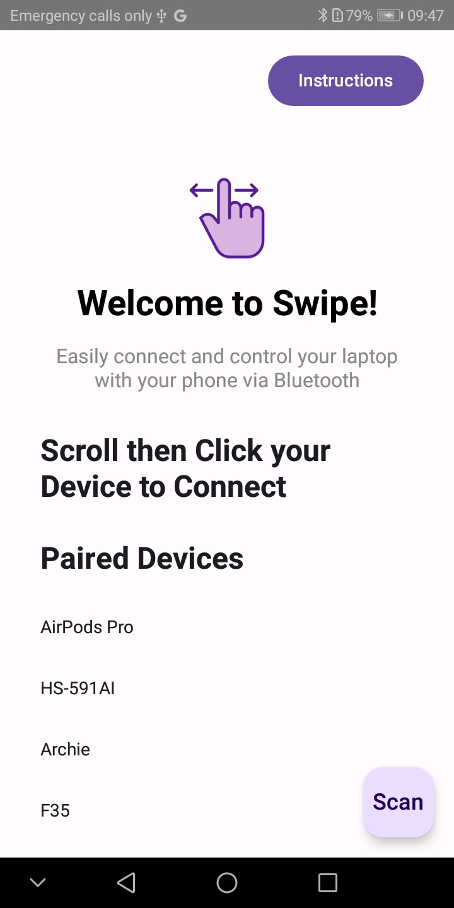
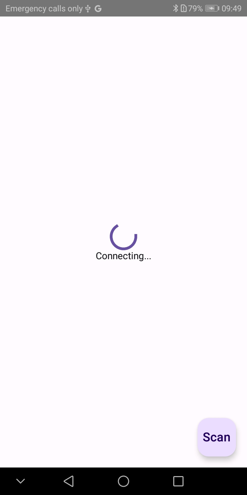
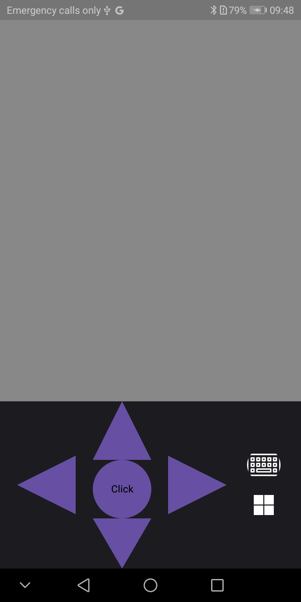
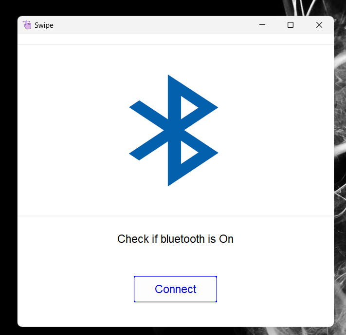
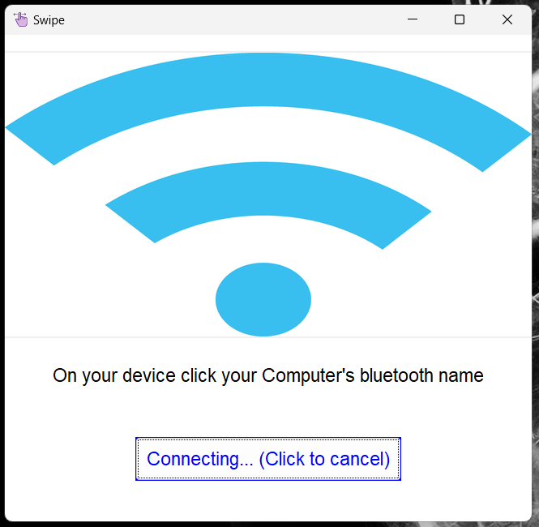
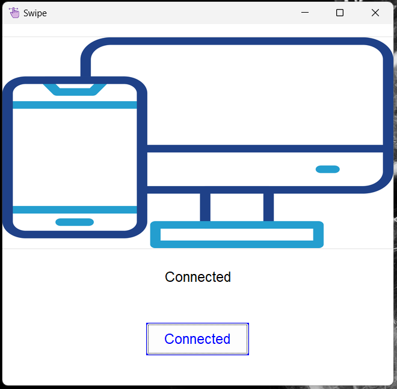

<h1 align="center">Swipe - Multi-Gesture Bluetooth Controller</h1> 

<p align="center">Seamlessly control your PC using gestures on your Android device.</p>

<h2 align="center">About the Project</h2>
Swipe is an application that transforms your Android device into a TrackPad and allows you to use it as a keyboard and mouse for your PC.

### Features
- **Intuitive Gestures**: Swipe, tap, drag, and scroll to interact with your PC.
- **Seamless Bluetooth Connection**: Reliable pairing between Android and PC.
- **Multi-Platform Use**: Extend PC usability through gesture-based controls.

---

<h2 align="center">Gestures And Actions</h2>

- **Two-Finger Swipe**: Scroll up and down on your PC.  
- **Double Tap**: Perform a left click.  
- **Round Center Button**: Use to select items.  
- **Long Press Center Button**: Perform a right click.  
- **Windows Button**: Open the Windows start menu.  
- **Keyboard Button**: Open the keyboard when typing.  

<h2 align="center">Screenshots</h2>

### Android App Screens
<div align="center">

  
  
  
  
  
</div>

### PC App Screens
<div align="center">
  
  
  
  
</div>

---

<h2 align="center">How to Use</h2>

### 
``` Kotlin
Instructions to Use
1. Open the Swipe app on your Android device and click Instructions to view how to use the app.
2. On your PC, open the PC App and click Connect.
3. On your phone, select your computer's Bluetooth name from the list (check for it in your phone's Bluetooth settings if needed).
4. To disconnect, simply click Back on your phone.

```

